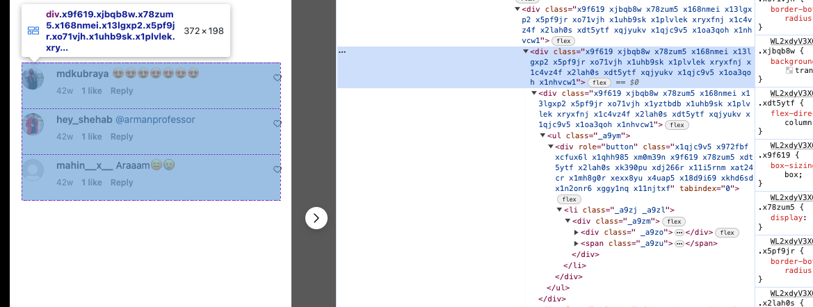

# Instagram Giveaway Winner App

This web application allows you to determine giveaway winners based on HTML markup extracted from an Instagram page. It processes the markup to find and randomly select winners among the contestants.

## Features

- **Input HTML Markup**: Paste the HTML markup from an Instagram page into the provided textarea.
- **Number of Winners**: Specify the number of winners you want to select using the input field.
- **Random Selection**: Randomly picks the specified number of winners from the contestants listed in the HTML markup.
- **Validation**: Validates input to ensure a positive number of winners and non-empty HTML markup before selecting winners.

## How to Use

1. **Input HTML Markup**:

   - Paste the HTML markup from the Instagram page into the textarea labeled "Please input the HTML markup from your page".

2. **Number of Winners**:

   - Enter the number of winners you want to select in the "Number of winners" input field.

3. **Get Winners**:

   - Click on the "Get winner" button to initiate the process.

4. **View Results**:
   - The total number of contestants found in the HTML markup will be displayed.
   - The selected winners will be displayed in the "Winner(s)" section.

## Example

## Technologies Used

- HTML
- CSS
- JavaScript
